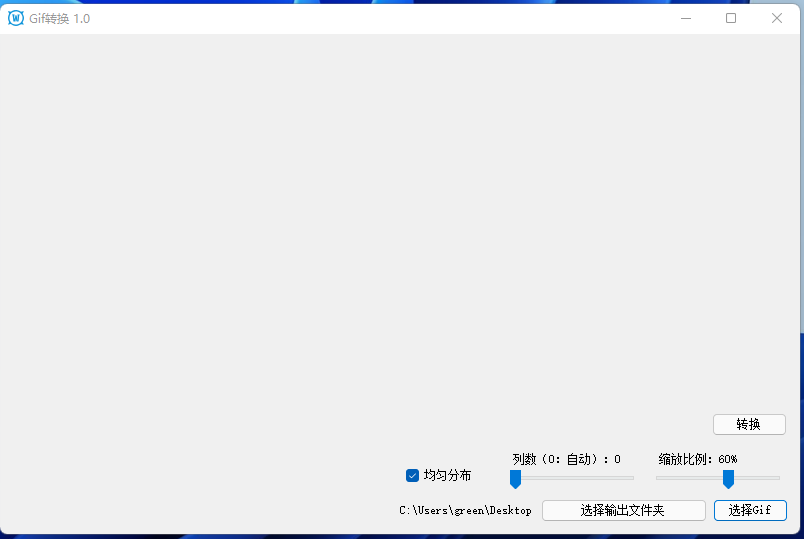
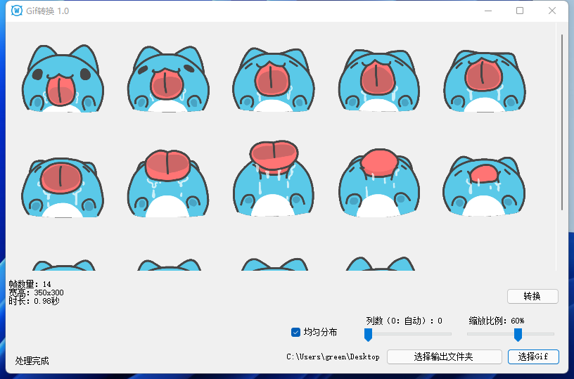

A simple winform project, Allows you to merge all frames within a gif into one image.

### Support
- Custom column count
- Custom zoom

### Preview
- Original gif:

- Open this tool:

- Select a gif:

- Click Convert(转换) button

### Note
- It is best to set the number of columns to 0, so that the number of columns of the generated image is automatically calculated, and theoretically the file size is the smallest.
- Larger Gifs will have memory issues because I display all frames loading them all into memory
